

  

<h1 align="center">CardTrack</h1>

  Built for UAE Banking & Financial Services Operations

 

  
  
  
  

## Project Overview

CardTrack is a Salesforce-based Credit Card Application Management System designed for UAE banking and financial services operations.

The solution supports customer onboarding, document management, application tracking, bank submissions, and operational monitoring within a single Salesforce application.

## Business Scenario

Credit card sales teams often rely on spreadsheets, emails, and messaging platforms to manage customer applications.

This can result in:

* Missing customer documents
* Delayed follow-ups
* Inconsistent data entry
* Limited application visibility
* Difficult performance tracking
* Manual reporting efforts

CardTrack addresses these challenges by providing a centralized Salesforce platform for application processing, workflow automation, data validation, and real-time operational reporting.

## Application Home Page

The CardTrack Home Page serves as the central workspace for application processing teams.

Features include:

* Company profile section
* Team collaboration feed
* DBR Calculator
* Announcements board
* Quick navigation links

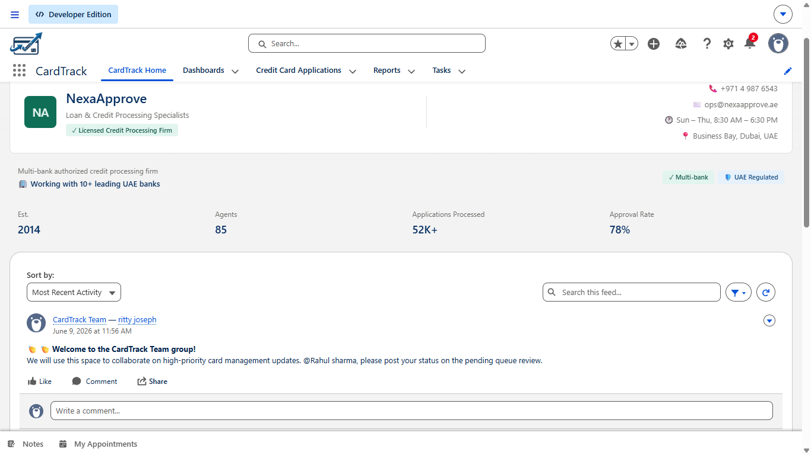

## Team Collaboration

Built-in collaboration using Salesforce Chatter enables officers and supervisors to communicate directly within the platform.

* Operational updates
* Team announcements
* Status discussions
* Workflow coordination

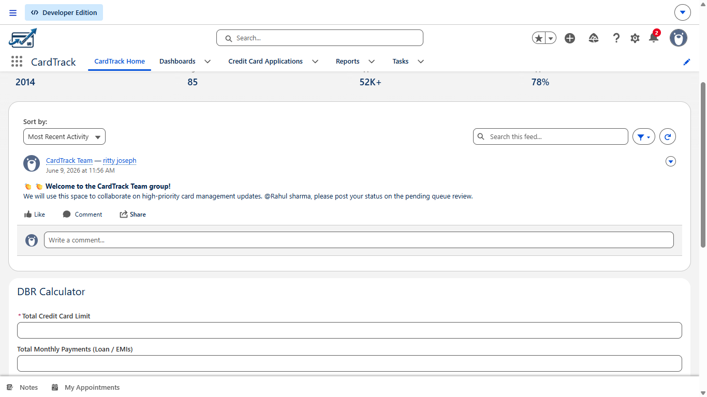

## DBR Calculator

A custom Debt Burden Ratio (DBR) Calculator helps officers evaluate customer eligibility.

Inputs include:

* Credit card limits
* Existing loan obligations
* Monthly income

This reflects a common credit assessment process used within UAE banking operations.

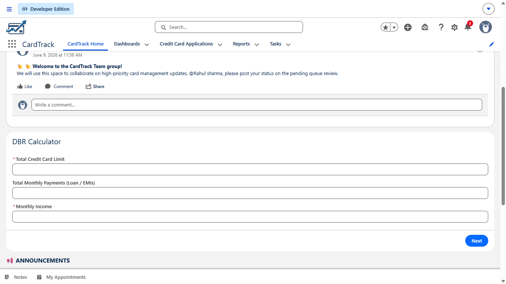

## Operational Announcements

A dedicated announcement section keeps teams informed about:

* Business reminders
* Target updates
* Important dates
* Internal contacts

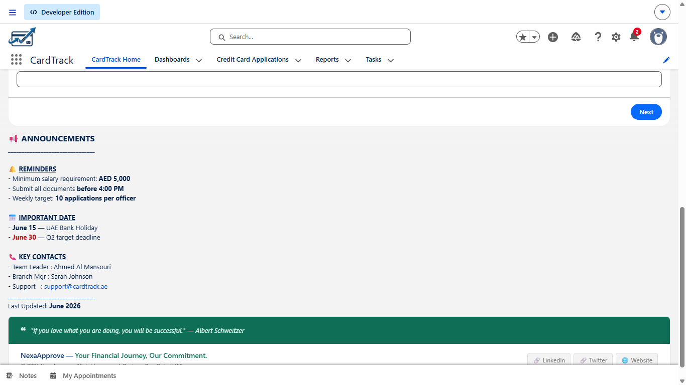

## Dashboard & Analytics

Management dashboards provide insight into application volume, approval trends, officer productivity, and bank submission performance.

These metrics help supervisors monitor operational KPIs and identify process bottlenecks.

Key metrics include:

* Total Applications
* Approved Applications
* Rejected Applications
* Application Pipeline
* Applications by Card Type
* Applications per Officer
* Bank Submission Analysis

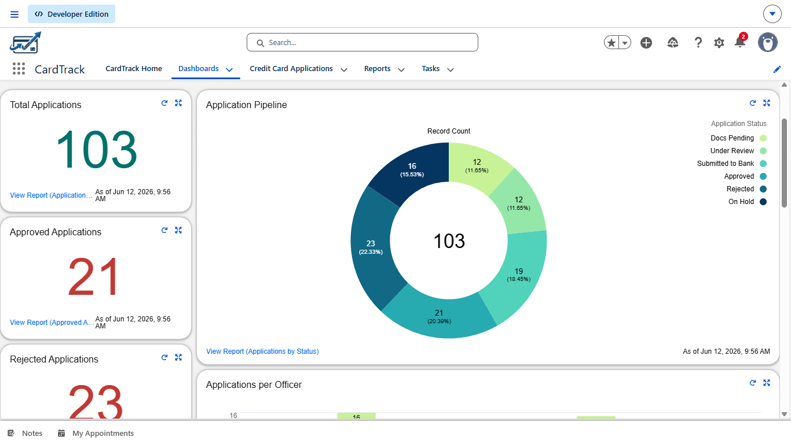
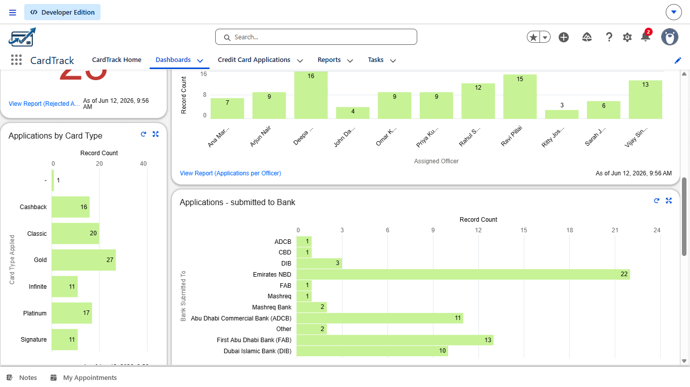

## Application Pipeline Monitoring

Track applications throughout the processing lifecycle:

* Documents Pending
* Under Review
* Submitted to Bank
* Approved
* Rejected
* On Hold

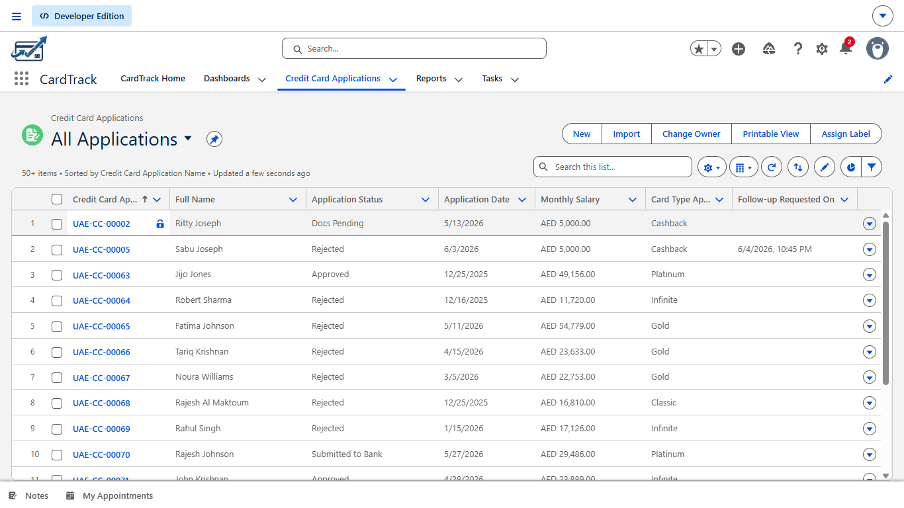
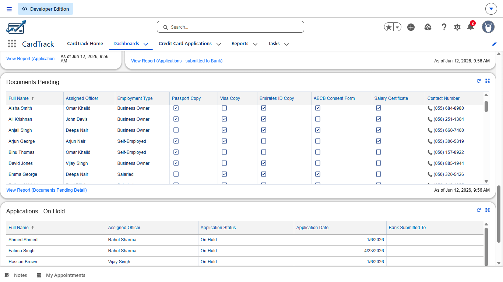

## Reporting

Custom reports provide operational insights for supervisors and management teams.

Examples include:

* Applications by Status
* Applications per Officer
* Applications by Bank
* Approval Analysis
* Pipeline Monitoring

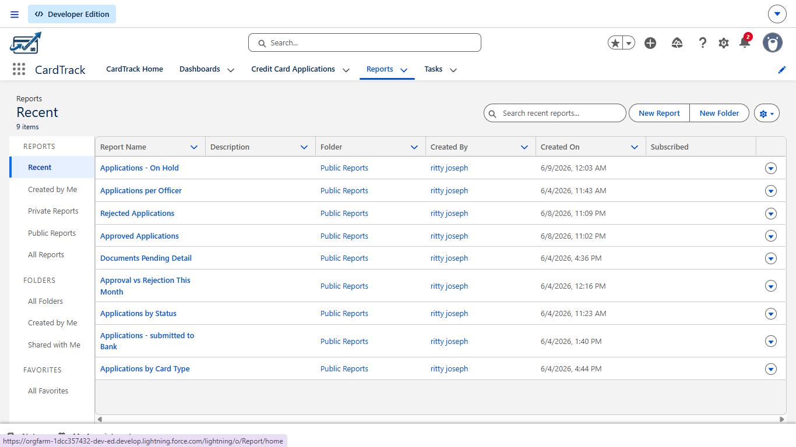

## Task Management

Salesforce Tasks help officers manage follow-ups and customer interactions efficiently.

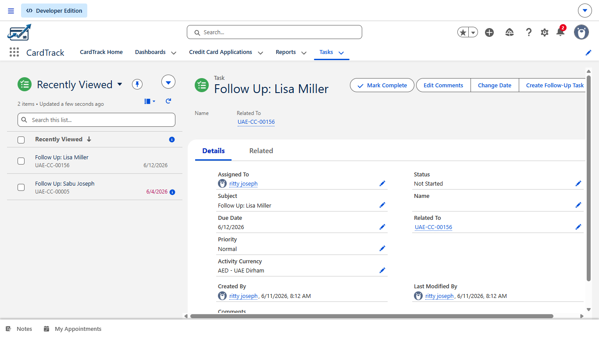

## Security Model

CardTrack implements a structured Salesforce security model to control 
data access and record visibility across the organisation.

**Organisation-Wide Defaults (OWD)**
- Credit Card Application object set to **Private**, ensuring officers 
  can only view records they own
- Restricts cross-team data visibility by default

**Role Hierarchy**
A 3-tier hierarchy controls record access upward through the organisation:

| Level | Role |
|-------|------|
| Tier 1 | NexaApprove CEO |
| Tier 2 | Operations Manager |
| Tier 3 | Credit Card Officers |

**Profiles & Permission Sets**
- Custom **Credit Card Officer Profile** with baseline object and field access
- **Senior Officer Permission Set** grants elevated access without modifying 
  the base profile

**Field-Level Security (FLS)**
Sensitive fields such as Monthly Income and Credit Limit are restricted 
at the field level, visible only to authorised roles.

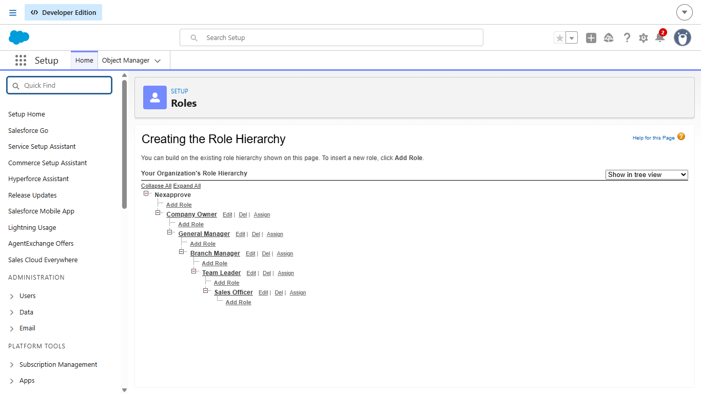

## Salesforce Capabilities Demonstrated

- Custom Objects and Fields
- Page Layout Configuration
- Lightning App Development
- Validation Rules
- Formula Fields
- Record-Triggered Flows
- Reports and Dashboards
- Role Hierarchy Configuration
- Chatter Collaboration
- Task Management
- Data Quality Controls
- Business Process Automation

## Technology Stack

| Technology           | Purpose             |
| -------------------- | ------------------- |
| Salesforce Lightning | CRM Platform        |
| Flow Builder         | Automation          |
| Reports & Dashboards | Analytics           |
| Validation Rules     | Data Quality        |
| Salesforce CLI       | Development         |
| VS Code              | Metadata Management |
| Git                  | Version Control     |
| GitHub               | Source Control      |

## Deployment

Metadata managed and deployed using Salesforce CLI and VS Code with the 
Salesforce Extension Pack. Source tracked via Git and hosted on GitHub.

🔗 [View Repository](https://github.com/RittyJoseph/CardTrack)

## Skills Demonstrated

This project demonstrates hands-on experience with:

* Salesforce Administration & Configuration — Custom objects, fields, layouts, and Lightning App setup
* Business Process Automation — 7 record-triggered flows covering application lifecycle events
* Data Quality Management — 10 validation rules enforcing UAE banking data standards
* Dashboard & Report Development — 9 operational reports and 9-component management dashboard
* Security & Access Management — Private OWD, 5-tier Role Hierarchy, custom Profiles, Permission Sets, and FLS
* Financial Services Workflow Design — DBR Calculator, application pipeline tracking, and bank submission monitoring
* User Experience Optimisation — Path component, Quick Actions, Compact Layouts, and List Views
  
## Author

**Ritty Joseph**

Salesforce Administrator | CRM & Financial Services Operations

This project demonstrates hands-on Salesforce administration across the full implementation lifecycle-data modelling, automation, 
analytics, security configuration, and UX design within a UAE credit card application management context.
 
🔗 [GitHub](https://github.com/RittyJoseph/CardTrack)
